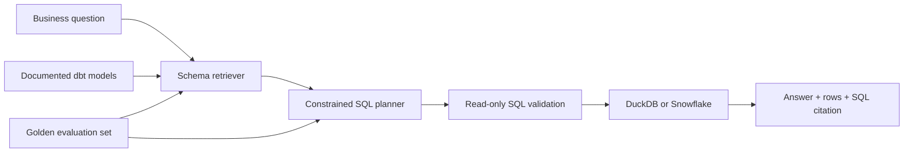

# SnowQuery

**Grounded natural-language analytics for Snowflake.**

[](https://github.com/Mohitbhavsar707/Snowquery/actions/workflows/ci.yml)


SnowQuery turns a focused set of plain-English business questions into safe analytical SQL, executes that SQL against modeled warehouse data, and returns the evidence alongside the answer. It is designed as a compact demonstration of schema retrieval, grounding, ELT with dbt, Snowflake integration, and repeatable evaluation.

The application runs locally with DuckDB for a zero-configuration demo and can use the same analytical models in Snowflake.

## Why this project exists

Natural-language data tools are only useful when their answers can be inspected and trusted. SnowQuery keeps the workflow deliberately narrow and observable:

1. Retrieve relevant documented models and columns.
2. Select a constrained, read-only SQL plan.
3. Execute the query against the warehouse.
4. Return the result rows and generated SQL as evidence.
5. Evaluate retrieval and execution against a versioned golden set.

## Results

The included eight-question golden set currently produces:

| Metric | Result | What it measures |
|---|---:|---|
| Retrieval hit@2 | 100% (8/8) | Expected dbt model appears in the top two retrieved contexts |
| Execution accuracy | 100% (8/8) | Query executes and returns the expected result column |

Reproduce these numbers with `python -m src.evaluate` after completing the local setup.

## Architecture



## Local demo

Requirements: Python 3.11 or newer.

```bash
git clone https://github.com/Mohitbhavsar707/Snowquery.git
cd Snowquery
python3 -m venv .venv
source .venv/bin/activate
pip install -r requirements.txt
python scripts/bootstrap_local.py
streamlit run app.py
```

Try questions such as:

- `What was total revenue by category?`
- `Which region had the most orders?`
- `Show monthly revenue trend`
- `Who are the top 5 customers by revenue?`

The local bootstrap creates `local.duckdb` from the synthetic seed data. That database is ignored by Git.

## Run the evaluation

```bash
python -m src.evaluate
```

Run the automated tests:

```bash
pip install -r requirements-dev.txt
pytest
```

## Snowflake and dbt

1. Create a Snowflake account and run [`snowflake/setup.sql`](snowflake/setup.sql) in a worksheet.
2. Install the dbt adapter and copy the supplied profile:

```bash
pip install dbt-snowflake
mkdir -p ~/.dbt
cp dbt/profiles.example.yml ~/.dbt/profiles.yml
```

3. Export credentials in your shell. Never put real values in the repository:

```bash
export SNOWFLAKE_ACCOUNT='your-org-your-account'
export SNOWFLAKE_USER='your-user'
export SNOWFLAKE_PASSWORD='your-password-or-token'
export SNOWFLAKE_ROLE='ACCOUNTADMIN'
export SNOWFLAKE_WAREHOUSE='RAG_WH'
export SNOWFLAKE_DATABASE='RAG_DEMO'
export SNOWFLAKE_SCHEMA='ANALYTICS'
```

4. Verify the connection, load the seed, and build the tested models:

```bash
cd dbt
dbt debug
dbt seed
dbt build
cd ..
```

5. Start the application against Snowflake:

```bash
WAREHOUSE_BACKEND=snowflake streamlit run app.py
```

The X-Small warehouse auto-suspends after 60 seconds of inactivity. Snowflake usage may still incur charges outside a trial account.

## Repository structure

```text
app.py                     Streamlit interface
src/assistant.py           retrieval, SQL planning, validation and execution
src/evaluate.py            golden-set evaluation harness
data/golden_set.json       versioned evaluation questions
dbt/models/                staging, fact and aggregate models with tests
dbt/seeds/raw_orders.csv   synthetic e-commerce orders
snowflake/setup.sql        warehouse, database and schema setup
scripts/bootstrap_local.py local DuckDB bootstrap
tests/                     deterministic unit and integration tests
```
## Safety and grounding

- Only a supported analytical intent can produce SQL.
- Only a single `SELECT` statement is accepted for execution.
- Results, retrieved schema context, and SQL are visible in the interface.
- Credentials are read from environment variables and excluded from version control.
- The bundled dataset is synthetic and contains no customer or personal data.

## Scope and limitations

SnowQuery is intentionally a deterministic MVP—not an LLM-powered text-to-SQL system. It uses lexical schema retrieval and a constrained intent planner, which keeps its behavior safe, inexpensive, and reproducible but limits the range of questions it understands.

A natural next iteration is to replace the planner with Snowflake Cortex while retaining SQL validation, result grounding, and the existing evaluation harness. Other useful extensions include semantic retrieval over dbt documentation, a larger adversarial golden set, and role-based query policies.

## License

Released under the [MIT License](LICENSE).
