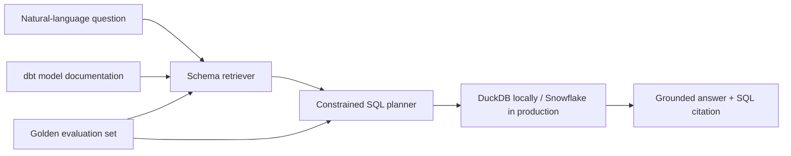

# Snowflake Grounded Data Assistant

A small, interview-ready natural-language analytics assistant. It retrieves relevant schema context, generates constrained SQL, executes it against modeled e-commerce data, and cites the rows used in its answer. A golden-set evaluator measures retrieval and execution accuracy.

The project runs locally with DuckDB for a zero-setup demo and includes a Snowflake + dbt path for deployment.

## What this demonstrates

- **RAG:** retrieves documented tables and columns before SQL generation
- **Grounding:** every answer comes from executed SQL and includes the SQL as a citation
- **Evaluation:** golden questions score retrieval hit rate and executable-answer accuracy
- **ELT/dbt:** raw orders are transformed into tested analytics marts
- **Snowflake:** warehouse DDL, seed loading, dbt profile, and connector support are included

## Run it today

```bash
python3 -m venv .venv
source .venv/bin/activate
pip install -r requirements.txt
python scripts/bootstrap_local.py
streamlit run app.py
```

Then try:

- `What was total revenue by category?`
- `Which region had the most orders?`
- `Show monthly revenue trend`
- `Who are the top 5 customers by revenue?`

Run the evaluation harness:

```bash
python -m src.evaluate
```

## Architecture



The current MVP uses a deterministic intent planner. This makes the evaluation repeatable and prevents arbitrary SQL. `src/assistant.py` is the seam where Cortex Complete or another LLM can later replace the planner while preserving retrieval, validation, execution, and evaluation.

## Snowflake + dbt setup

1. Create a Snowflake trial and run `snowflake/setup.sql` in a worksheet.
2. Export credentials (never commit them):

```bash
export SNOWFLAKE_ACCOUNT='...'
export SNOWFLAKE_USER='...'
export SNOWFLAKE_PASSWORD='...'
export SNOWFLAKE_ROLE='ACCOUNTADMIN'
export SNOWFLAKE_WAREHOUSE='RAG_WH'
export SNOWFLAKE_DATABASE='RAG_DEMO'
export SNOWFLAKE_SCHEMA='ANALYTICS'
```

3. Install dbt and build the models:

```bash
pip install dbt-snowflake
cp dbt/profiles.example.yml ~/.dbt/profiles.yml
cd dbt
dbt seed
dbt build
```

4. Set `WAREHOUSE_BACKEND=snowflake` before launching Streamlit.

## Repository map

```text
app.py                    Streamlit demo
src/assistant.py          retrieval, planning, SQL execution, grounding
src/evaluate.py           evaluation harness
data/golden_set.json      reproducible evaluation questions
dbt/models/               staging and mart SQL + tests/docs
dbt/seeds/raw_orders.csv  small public-style synthetic dataset
snowflake/setup.sql       Snowflake objects
```

## Honest resume wording

After running the Snowflake/dbt path:

> Built a grounded natural-language analytics assistant on Snowflake, modeled raw order data into tested marts with dbt, retrieved schema context before SQL generation, and evaluated retrieval and executable-answer accuracy against a golden question set.

Until then, describe it as **Snowflake-ready** rather than deployed on Snowflake.

